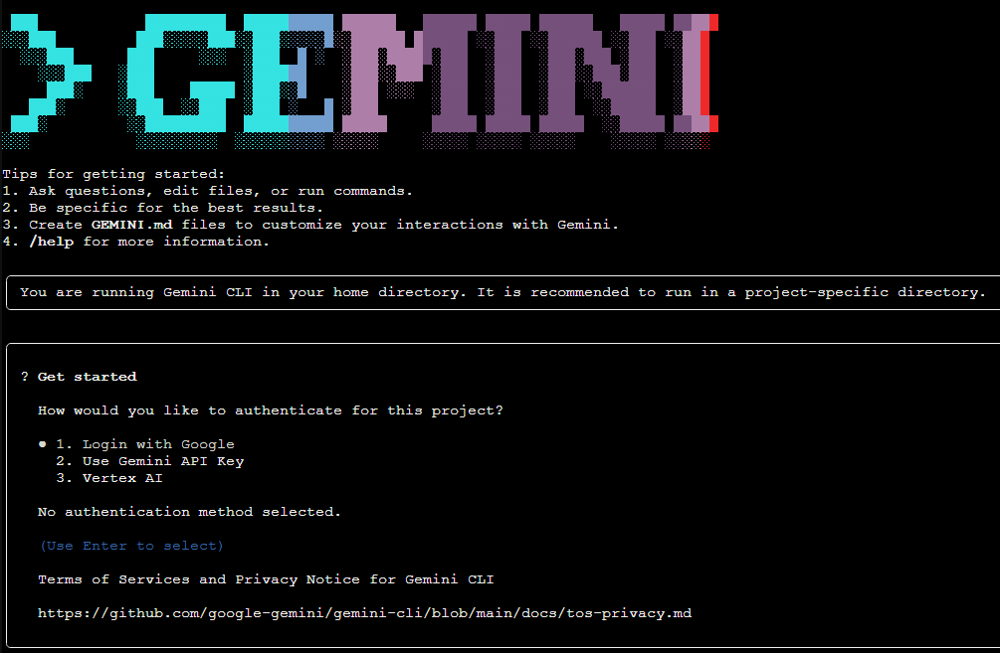
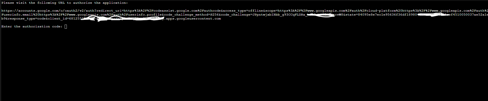
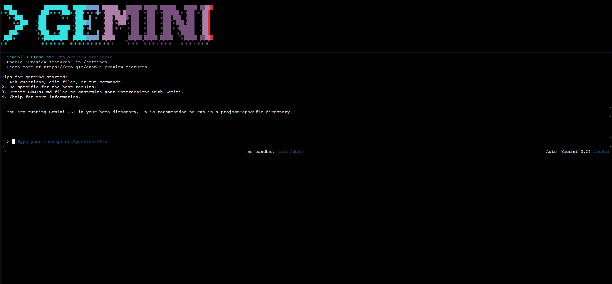
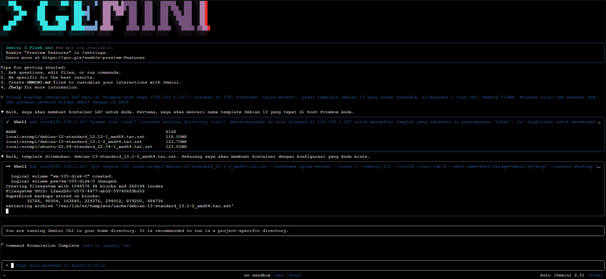
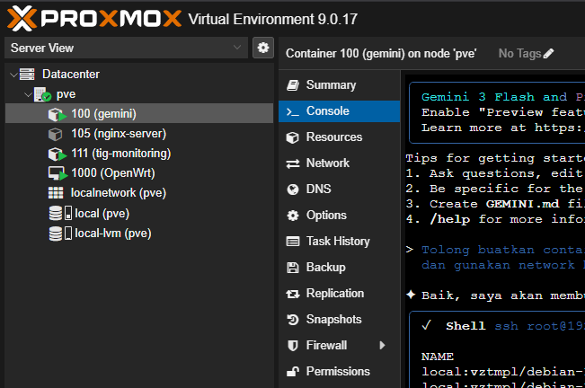
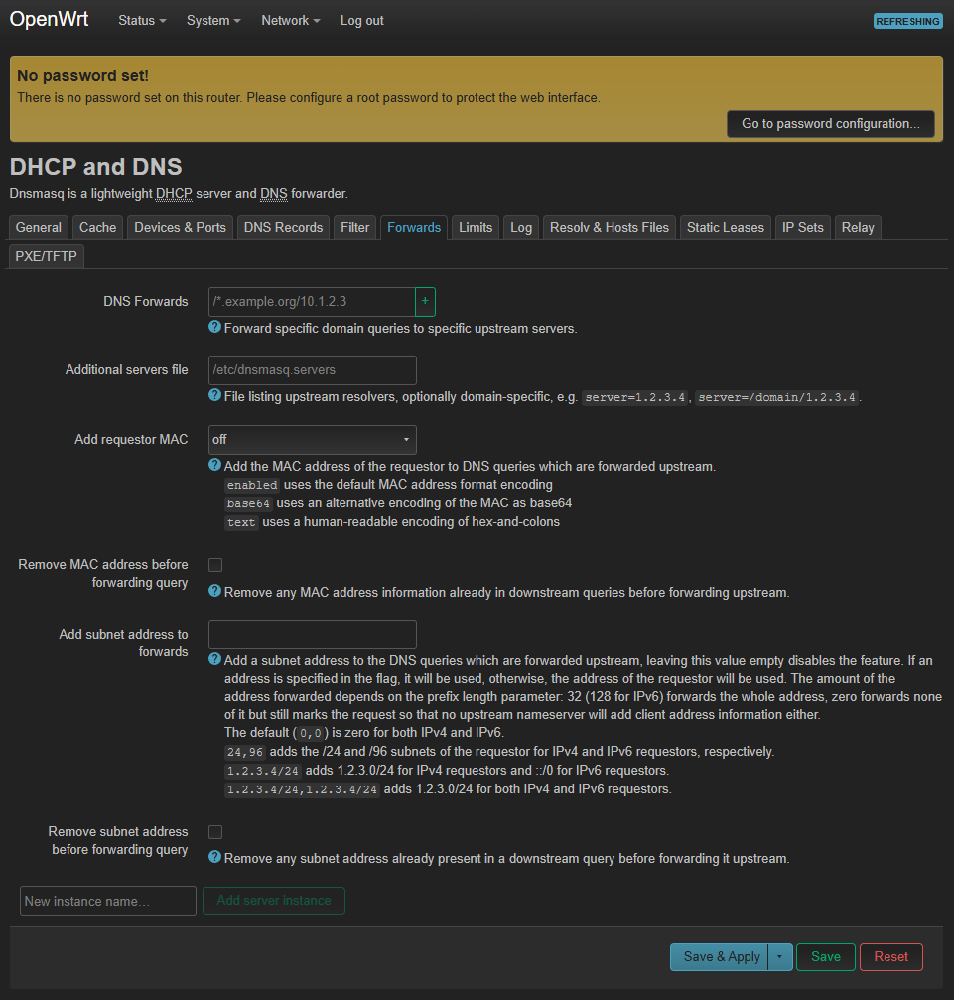
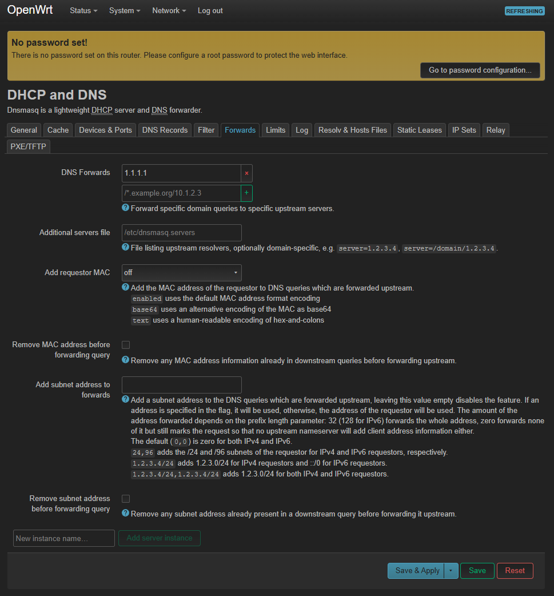

# Panduan Setup Manual Gemini CLI di Proxmox LXC

Dokumen ini berisi panduan langkah demi langkah untuk melakukan instalasi manual Gemini CLI pada container Proxmox (LXC). Panduan ini disusun berdasarkan logika script otomasi `gemini.sh`.

## Instalasi Otomatis (Cara Cepat)

Jika Anda ingin melewati langkah-langkah manual di bawah ini, Anda dapat langsung menjalankan script otomasi yang telah disediakan.

1.  **Download atau Upload** file `gemini.sh` ke server Proxmox Anda.
2.  **Jalankan script:**
    ```bash
    chmod +x gemini.sh
    ./gemini.sh
    ```
    *Script ini akan menangani pembuatan container, konfigurasi, dan instalasi dependencies secara otomatis (Langkah 1 s.d. 4).*

---

## Prasyarat Manual

Jika Anda memilih instalasi manual, pastikan hal-hal berikut tersedia di server Proxmox Anda:

1.  **Template LXC:** `local:vztmpl/debian-13-standard_13.1-2_amd64.tar.zst`
    *   *Catatan:* Sesuaikan path ini jika Anda menyimpan template di storage yang berbeda atau menggunakan versi Debian lain.
2.  **Storage ID:** `local-lvm` (Target penyimpanan disk container).
3.  **Network Bridge:** `vmbrlan`
    *   **Penting:** Jika Anda menggunakan konfigurasi standar Proxmox, ganti `vmbrlan` menjadi **`vmbr0`**.

---

## Langkah 1: Bersihkan Container Lama (Opsional)

Jika container dengan ID `100` sudah ada dan ingin di-reset, jalankan perintah berikut:

**1. Matikan Container:**
```bash
pct stop 100
```

**2. Hapus Container:**
```bash
pct destroy 100 --purge
```

---

## Langkah 2: Buat Container Baru

Jalankan perintah di bawah ini pada shell Host Proxmox untuk membuat container.

> **Perhatian:** Jangan lupa sesuaikan `bridge=vmbrlan` menjadi `bridge=vmbr0` jika diperlukan.

```bash
pct create 100 local:vztmpl/debian-13-standard_13.1-2_amd64.tar.zst \
    --hostname gemini \
    --password telkom123 \
    --rootfs volume=local-lvm:8 \
    --memory 2048 \
    --cores 2 \
    --net0 name=eth0,bridge=vmbrlan,ip=dhcp \
    --features nesting=1 \
    --onboot 1 \
    --unprivileged 1
```

### Penjelasan Parameter Utama

| Parameter | Deskripsi |
| :--- | :--- |
| `--rootfs volume=local-lvm:8` | Disk 8GB pada storage `local-lvm`. |
| `--memory 2048` | RAM 2GB. |
| `--net0 ...` | Network DHCP pada bridge yang dipilih. |
| `--features nesting=1` | Fitur nesting (wajib untuk Docker/modern apps). |
| `--unprivileged 1` | Container mode unprivileged (lebih aman). |

---

## Langkah 3: Jalankan Container

Nyalakan container yang baru dibuat:

```bash
pct start 100
```

*Tunggu 5-10 detik agar proses booting selesai.*

---

## Langkah 4: Install Dependencies & Gemini CLI

Anda memiliki dua opsi untuk melakukan instalasi: **Eksekusi dari Host** atau **Masuk ke Container**.

### Opsi A: Eksekusi Langsung dari Host (Cepat)

Jalankan perintah berikut langsung dari shell Proxmox:

**1. Update OS & Install Node.js:**
```bash
pct exec 100 -- bash -c "apt-get update && apt-get install -y curl git nodejs npm openssh-server openssh-client"
```

**2. Install Gemini CLI Global:**
```bash
pct exec 100 -- npm install -g @google/gemini-cli
```

### Opsi B: Masuk ke Container (Manual)

Jika ingin melihat prosesnya secara langsung di dalam container:

**1. Masuk ke shell container:**
```bash
pct enter 100
```

**2. Jalankan instalasi paket:**
```bash
apt-get update
apt-get install -y curl git nodejs npm openssh-server openssh-client
```

**3. Install Gemini CLI:**
```bash
npm install -g @google/gemini-cli
```

**4. Keluar (Opsional):**
Ketik `exit` untuk kembali ke host.

---

## Langkah 5: Login & Setup SSH (Wajib)

Tahap ini krusial agar Gemini dapat digunakan dan memiliki akses untuk mengelola server Proxmox Anda secara otomatis.

### 1. Login ke Gemini

Masuk ke container dan jalankan `gemini`. Jika belum login, Anda akan melihat menu pilihan.

```bash
pct enter 100
gemini
```

**Proses Login:**

1.  **Pilih Metode Login:**
    Akan muncul 3 opsi. Pilih **No. 1** (Login with Google).
    
    

2.  **Dapatkan Link Autentikasi:**
    Gemini akan memberikan link URL panjang. Salin link tersebut.
    
    

3.  **Buka di Browser:**
    Buka browser di laptop/PC Anda, paste link tadi, dan login menggunakan akun Google Anda. Setelah berhasil, salin **Token** yang muncul.
    
    

4.  **Paste Token & Mulai Chat:**
    Kembali ke terminal, paste token, lalu tekan Enter. Anda akan melihat tampilan awal chat.
    
    

---


### 2. Setup SSH Key (Container ke Host)

Agar Gemini bisa mengotomatisasi perintah Proxmox, container `gemini` harus bisa SSH ke `host` (fisik) tanpa password.

**Lakukan langkah ini DI DALAM CONTAINER** (`pct enter 100`).

**A. Generate SSH Key:**

```bash
ssh-keygen -t rsa -b 4096
```
*(Tekan ENTER terus untuk semua pertanyaan)*

Contoh Output:
```text
root@gemini:~# ssh-keygen -t rsa -b 4096
Generating public/private rsa key pair.
Enter file in which to save the key (/root/.ssh/id_rsa): 
Enter passphrase for "/root/.ssh/id_rsa" (empty for no passphrase): 
Your identification has been saved in /root/.ssh/id_rsa
Your public key has been saved in /root/.ssh/id_rsa.pub
...
```

**B. Salin Key ke Host Proxmox:**

Anda perlu tahu IP Host Proxmox (misal: `192.168.1.167`).

```bash
# Ganti 192.168.1.167 dengan IP asli server Proxmox Anda
ssh-copy-id root@192.168.1.167
```
*(Masukkan password root Proxmox Host saat diminta)*

Contoh Output:
```text
root@gemini:~# ssh-copy-id root@192.168.1.167
...
Are you sure you want to continue connecting (yes/no/[fingerprint])? yes
root@192.168.1.167's password: 
Number of key(s) added: 1
...
```

**C. Tes Koneksi:**

Coba SSH kembali untuk memastikan tidak ada password yang diminta.

```bash
ssh root@192.168.1.167
```

Contoh Output Berhasil:
```text
root@gemini:~# ssh root@192.168.1.167
Linux pve 6.17.2-1-pve #1 SMP ...
root@pve:~#
```
*(Jika prompt berubah menjadi `root@pve:~#`, koneksi sukses)*

---


## Langkah 6: Verifikasi Akhir & Tips

Setelah setup selesai, Gemini CLI siap digunakan.

**1. Masuk ke container:**
```bash
pct enter 100
```

**2. Mulai Gemini (Mode Standar):**
```bash
gemini
```

**3. Mulai Gemini (Mode Otomatis / YOLO):**
Untuk menghindari konfirmasi manual setiap kali Gemini ingin mengeksekusi perintah (berguna untuk otomatisasi cepat), gunakan flag `--yolo`. **Gunakan dengan bijak (Do Your Own Research)!**

```bash
gemini --yolo
```

**4. Keluar dari Chat:**
Untuk berhenti chatting dan kembali ke terminal Linux, tekan **`Ctrl+C`** sebanyak **2 kali**.

---


## Contoh Penggunaan Lanjut (Advanced Usage Preview)

Berikut adalah contoh bagaimana Anda dapat menggunakan Gemini CLI untuk mengotomatisasi tugas-tugas infrastruktur.

### Kasus 1: Membuat Container Otomatis
Anda dapat meminta Gemini untuk membuatkan container baru tanpa perlu mengetik perintah `pct create` yang panjang secara manual. Gemini di dalam container akan melakukan SSH ke Host Proxmox (`192.168.1.167`) untuk mengeksekusi perintah tersebut.

**Contoh Prompt:**
> "Tolong buatkan container LXC baru di Proxmox host saya (192.168.1.167). Gunakan ID 105, hostname 'nginx-server', pakai template Debian 13 yang sudah tersedia, alokasikan 1 Core CPU, Memory 512MB, Storage local-lvm sebesar 4GB, dan gunakan network bridge vmbr0 dengan IP DHCP."

**Preview Eksekusi di Gemini:**



**Hasil di Proxmox GUI:**



---


### Kasus 2: Konfigurasi DNS OpenWRT Remote
Jika Anda memiliki perangkat jaringan lain (seperti OpenWRT) yang bisa diakses via SSH, Gemini juga bisa mengelolanya.

**Skenario:** Mengubah DNS di router OpenWRT (IP: 192.168.1.21) menjadi 1.1.1.1.

**Contoh Prompt:**
> "Saya ingin mengubah DNS di router OpenWRT saya yang ada di IP 192.168.1.21. Tolong ganti DNS forwarding-nya menjadi 1.1.1.1. Cek dulu konfigurasi saat ini sebelum dan sesudah perubahan untuk memastikan berhasil."

**Preview Eksekusi:**

**A. Sebelum (Cek Konfigurasi Awal):**



**B. Proses Eksekusi Gemini:**


**C. Sesudah (Verifikasi Perubahan):**


